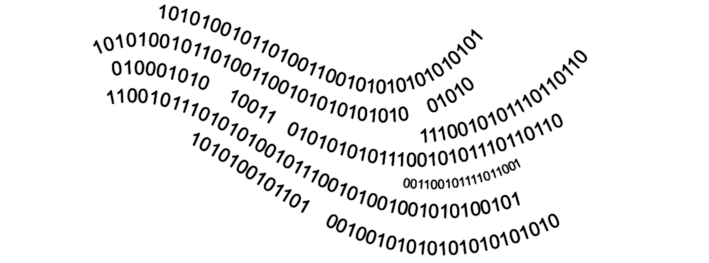

# 🖥️ Bitwise

`bs.math:bitwise`: This folder contains various bitwise operators to
apply to scores.

<div align=center>



</div>

```{button-link} https://youtu.be/itgPhvTMSZQ
:color: primary
:align: center
:shadow:

{octicon}`device-camera-video` Watch a demo
```

<div align=center>

_Friendly advice: decrease the volume before clicking_ 😅

</div>

---

## logical AND

`and`: Computes the bitwise conjunction of the two input numbers

-  Takes the scores `bs.var0` and `bs.var1` as parameters
-  Returns the value of the operation `bs.var0 & bs.var1` on the
   score `bs.res0`.
-  If one of the inputs is negative, the operation will be done between
   the first operand and the two's complement of the second

*Example:*

-  Calculate and display -9 & 57
   ```
   # Once
   scoreboard players set @s bs.var0 -9
   scoreboard players set @s bs.var1 57
   function bs.math:bitwise/and
   tellraw @a [{"text":"-9 & 57 = ", "color": "dark_gray"},{"score":{"name":"@s", "objective": "bs.res0"}, "color": "gold"}]
   ```

---

## Get number of bits

`get_number_of_bits`: Calculates the number of bits needed to store
the input

-  Takes the score `bs.var0` as parameter
-  Returns the number of bits needed to store the input
-  If the input is negative, returns the number of bits needed to store
   the absolute value of the number

*Example:*

-  Calculate and display the number of bits of 12
   ```
   # Once
   scoreboard players set @s bs.var0 12
   function bs.math:bitwise/get_number_of_bits
   tellraw @a [{"text": "Number of bits of 12 = ", "color": "dark_gray"},{"score":{"name":"@s", "objective": "bs.res0"}, "color": "gold"}]
   ```

---

## logical NOT

`not`: Computes the bit by bit negation of the input

-  Takes the score `bs.var0` as parameter
-  Returns the value of the operation `~bs.var0` on the score
   `bs.res0`.

*Example:*

-  Calculate and display ~452
   ```
   # Once
   scoreboard players set @s bs.var0 452
   function bs.math:bitwise/not
   tellraw @a [{"text":"~452 = ", "color": "dark_gray"},{"score":{"name":"@s", "objective": "bs.res0"}, "color": "gold"}]
   ```

---

## OR logic

`or`: Computes the bit to bit disjunction of the two input numbers

-  Takes as parameters the scores `bs.var0` and `bs.var1`.
-  Returns the value of the operation `bs.var0 | bs.var1` on the
   score `bs.res0`.
-  If one of the inputs is negative, the operation will be done between
   the first operand and the two's complement of the second

*Example:*

-  Calculate and display -9 \| 57.
   ```
   # Once
   scoreboard players set @s bs.var0 -9
   scoreboard players set @s bs.var1 57
   function bs.math:bitwise/gold
   tellraw @a [{"text":"-9 | 57 = ", "color": "dark_gray"},{"score":{"name":"@s", "objective": "bs.res0"}, "color": "gold"}]
   ```

---

## Complement to 2

`two_complement`: Computes the two's complement of the input

-  Takes the score `bs.var0` as parameter
-  Returns the two's complement of `bs.var0` over the score
   `bs.res0`.

*Example:*

-  Calculate and display the two's complement of 12
   ```
   # Once
   scoreboard players set @s bs.var0 12
   function bs.math:bitwise/to_complement
   tellraw @a [{"text": "Two's complement of 12 = ", "color": "dark_gray"},{"score":{"name":"@s", "objective": "bs.res0"}, "color": "gold"}]
   ```

---

## OR exclusive

`xor`: Computes the exclusive bit by bit disjunction of the two input
numbers

-  Takes as parameters the scores `bs.var0` and `bs.var1`.
-  Returns the value of the operation `bs.var0 ^ bs.var1` on the
   score `bs.res0`
-  If one of the inputs is negative, the operation will be done between
   the first operand and the two's complement of the second

*Example:*

-  Calculate and display -9 ^ 57
   ```
   # Once
   scoreboard players set @s bs.var0 -9
   scoreboard players set @s bs.var1 57
   function bs.math:bitwise/xor
   tellraw @a [{"text":"-9 ^ 57 = ", "color": "dark_gray"},{"score":{"name":"@s", "objective": "bs.res0"}, "color": "gold"}]
   ```

---

# 💬 Did it help you?

Feel free to leave your questions and feedbacks below!

<script src="https://giscus.app/client.js"
        data-repo="Gunivers/Glibs"
        data-repo-id="R_kgDOHQjqYg"
        data-category="Documentation"
        data-category-id="DIC_kwDOHQjqYs4CUQpy"
        data-mapping="title"
        data-strict="0"
        data-reactions-enabled="1"
        data-emit-metadata="0"
        data-input-position="bottom"
        data-theme="light"
        data-lang="fr"
        data-loading="lazy"
        crossorigin="anonymous"
        async>
</script>